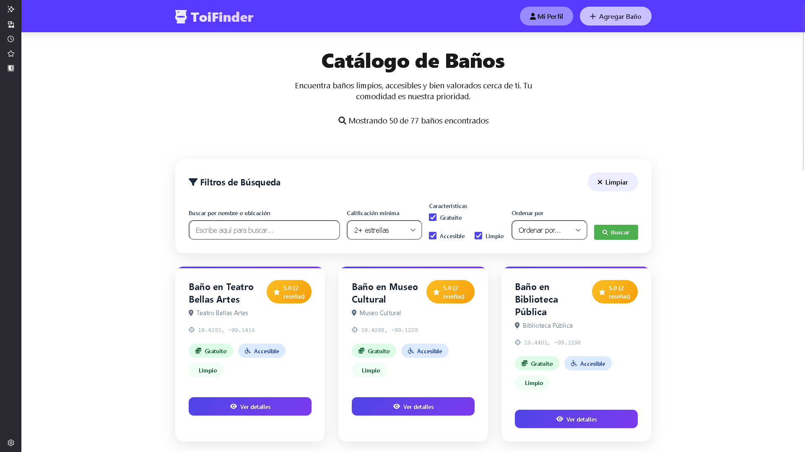
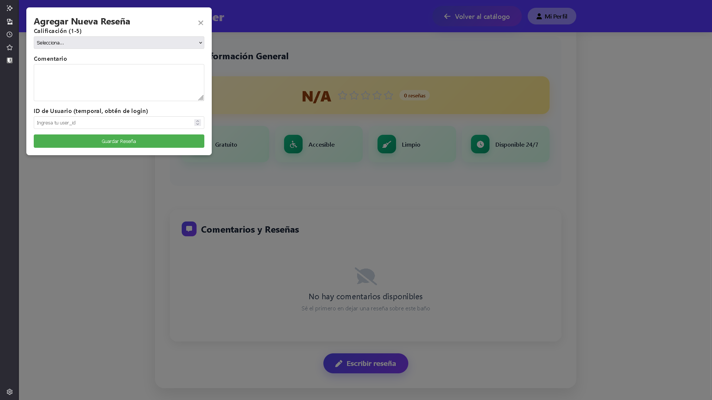
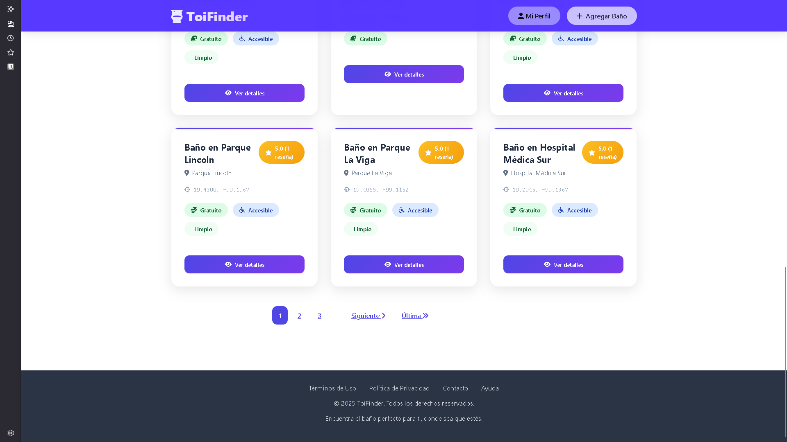

# 🚻 ToiFinder

> **ToiFinder** es una aplicación web desarrollada en Django que permite encontrar, reseñar y calificar baños públicos. Su objetivo es mejorar la experiencia de los usuarios al buscar servicios sanitarios, mostrando información relevante, reseñas y fotos.

---

## 📸 Capturas de pantalla

| Vista principal | Formulario de reseña | Paginación |
|:---------------:|:-------------------:|:---------------------:|
|  |  |  |

---

## 1️⃣ Descripción breve

ToiFinder es una plataforma colaborativa donde puedes:

- Buscar baños públicos por ubicación y características.
- Leer y agregar baños, reseñas y puntuaciones.
- Consultar información actualizada y relevante gracias a la búsqueda semántica con ChromaDB.

---

## 2️⃣ Características principales

| Característica                    | Descripción                                                                                   |
|------------------------------------|----------------------------------------------------------------------------------------------|
| 🔎 Búsqueda avanzada               | Encuentra baños por ubicación, accesibilidad, limpieza y otros filtros.                       |
| 📝 Reseñas y puntuaciones          | Agrega y visualiza comentarios y calificaciones de otros usuarios. |
| 🔒 Autenticación                   | Registro, login y gestión segura de usuarios.                                                 |
| 🤖 Búsqueda semántica (ChromaDB)   | Resultados relevantes gracias a embeddings generados y almacenados en ChromaDB.              |

---

## 3️⃣ Tecnologías utilizadas

| Tecnología         | Uso principal                                                     |
|--------------------|-------------------------------------------------------------------|
| Django             | Backend, API REST, autenticación y lógica de negocio              |
| HTML              | Estructura semántica del frontend                                 |
| CSS               | Estilos, diseño responsivo y atractivo                            |
| JavaScript     | Eventos, interacción, consumo de API y gestión de datos           |
| ChromaDB           | Base vectorial para búsquedas semánticas                          |
| PostgreSQL  | Base de datos relacional |

---

## 4️⃣ Instalación y configuración

Sigue estos pasos para instalar y ejecutar ToiFinder en tu entorno local:

```bash
# 1. Clona el repositorio
git clone https://github.com/Angel-crypt/TRONO-SEGURO.git
cd TRONO-SEGURO

# 2. Crea y activa un entorno virtual
python -m venv venv
source venv/bin/activate  # En Windows: venv\Scripts\activate

# 3. Instala las dependencias
pip install -r requirements.txt

# 4. Crea y configura variables de entorno
.env

# 5. Realiza las migraciones de base de datos
python manage.py migrate

# 6. Carga datos iniciales (fixtures)
python manage.py loaddata initial_data.json

# 7. Levanta el servidor de desarrollo
python manage.py runserver
```

---

## 5️⃣ Estructura del proyecto

```
TRONO-SEGURO/
├── toiFinder/                # App principal Django
│   ├── templates/            # HTML semántico
│   ├── static/
│   │   ├── css/              # Un archivo CSS por cada HTML
│   │   ├── js/               # Un archivo JS por cada HTML
│   ├── views.py              # Vistas y lógica de negocios
│   ├── urls.py               # Sistema de rutas Django
│   └── management/
│       └── commands/
│           └── populate_vector_db.py  # Comando para ChromaDB
├── ScreenShots/              # Capturas de pantalla
├── db.sqlite3                # Base de datos (desarrollo)
├── manage.py                 # Comando principal Django
├── requirements.txt          # Dependencias Python
└── README.md                 # Este archivo
```

---

## 6️⃣ Sistema de rutas (URLs Django)

| URL                       | Funcionalidad                    | Método        |
|---------------------------|----------------------------------|--------------|
| `/catalog`                       | Home / búsqueda principal        | GET, POST    |
| `/login/`                 | Autenticación (login)            | GET, POST    |
| `/logout/`                | Cierre de sesión                 | GET          |
| `/bathroom/<id>/`         | Detalle y reseñas del baño       | GET          |
| `/bathroom/add/`          | Agregar baño público             | GET, POST    |
| `/review/add/`            | Agregar reseña                   | POST         |
| `/api/bathrooms/`         | API REST: listado/filtrado       | GET          |
| `/api/reviews/`           | API REST: reseñas                | GET, POST    |

---

## 7️⃣ Lógica del frontend y su interacción con el backend

### Estructura y organización

- **HTML semántico:** Cada vista HTML usa etiquetas como `<header>`, `<nav>`, `<section>`, `<article>`, `<footer>`, `<aside>` para mejorar accesibilidad y SEO.
- **CSS separado:** Cada HTML tiene su propio archivo CSS en `/static/css/`.
- **JavaScript modular:** Cada HTML tiene su propio JS en `/static/js/`, organizado por funcionalidades y eventos.

**Eventos utilizados:**
- `click` para botones y enlaces interactivos.
- `submit` para formularios de búsqueda y reseña.
- `keydown` para accesibilidad (ej. accesos rápidos).
- `fetch` para consumir API REST del backend Django.

---

## 9️⃣ Poblar la base vectorial (ChromaDB) con embeddings

Este proyecto incluye un comando personalizado para poblar ChromaDB con embeddings, facilitando búsquedas semánticas avanzadas.

### Uso del comando

```bash
python manage.py populate_vector_db
```

### ¿Qué hace?

1. Lee datos relevantes desde la base de datos.
2. Genera embeddings usando el modelo configurado.
3. Inserta o actualiza los vectores en ChromaDB para futuras consultas.

### Notas

- Asegúrate de tener ChromaDB configurado y corriendo.
- Puedes modificar el comportamiento editando:
  ```
  toiFinder/management/commands/populate_vector_db.py
  ```
- El comando es **idempotente**: actualiza embeddings existentes, no los duplica.

---
